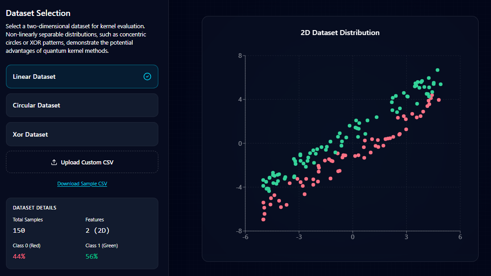
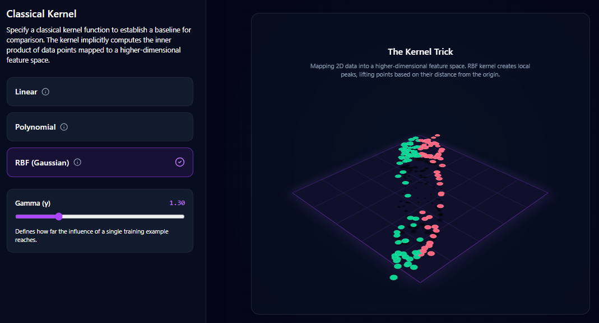
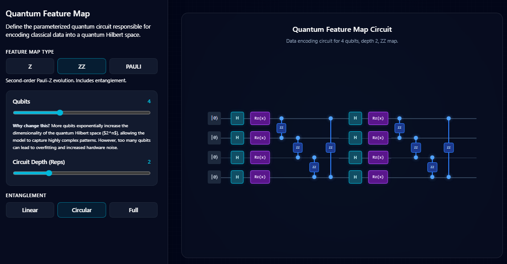
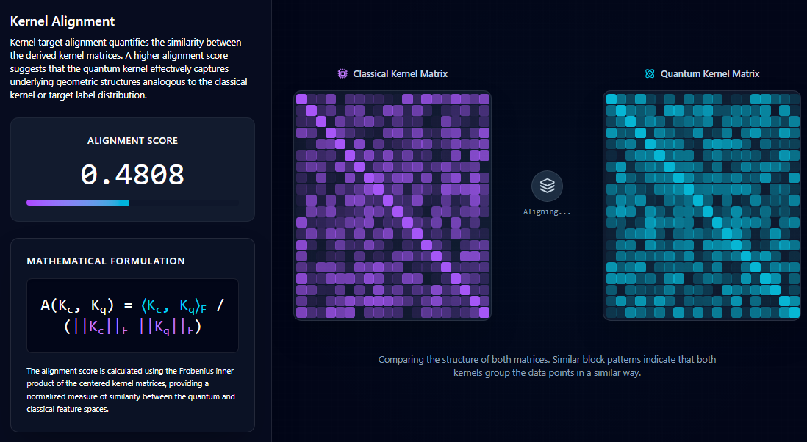
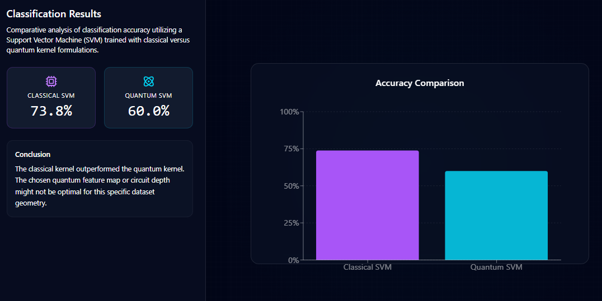

 1. Dataset Selection

Select a dataset from the available options (**Linear, Circular, or XOR**) or upload your own dataset using the **Upload Custom CSV** option.

Once a dataset is selected, the system displays:

- The **2D dataset distribution** on the right side as a scatter plot.
- **Dataset details**, including the number of samples, number of features, and class distribution.

This step allows you to visually inspect the dataset before applying kernel methods.

 2. Kernel Selection

Choose a **classical kernel function** that will serve as the baseline for comparison.

Available kernel options include:

- **Linear Kernel**
- **Polynomial Kernel**
- **RBF (Gaussian) Kernel**

If the **RBF kernel** is selected, adjust the **gamma (γ) parameter** using the slider to control the influence range of individual data points.

This step defines how the classical model transforms the dataset into a higher-dimensional feature space.

 3. Quantum Feature Map Configuration

Configure the **quantum feature map**, which encodes classical data into a quantum Hilbert space.

Perform the following settings:

- Select a **feature map type** (**Z, ZZ, or Pauli**).
- Use the **Qubits slider** to define the number of qubits in the circuit.
- Use the **Circuit Depth (Reps)** slider to set the number of circuit repetitions.
- Choose the **entanglement structure** (**Linear, Circular, or Full**).

The quantum circuit diagram is displayed on the right side to visualize how the data will be encoded.

 4. Kernel Alignment Analysis

Click the **Simulate** button to compute and compare the kernel structures.

The system will display:

- The **Kernel Alignment Score**, which measures the similarity between classical and quantum kernel matrices.
- The **Classical Kernel Matrix** visualization.
- The **Quantum Kernel Matrix** visualization.

Higher alignment values indicate that the quantum kernel captures data relationships similar to the classical kernel.

 5. Classification Results

Finally, the system trains **Support Vector Machine (SVM)** models using both classical and quantum kernels.

The results section shows:

- **Classification accuracy for the Classical SVM**
- **Classification accuracy for the Quantum SVM**
- A **visual comparison chart**

This step allows users to evaluate how effectively the quantum kernel performs compared to the classical kernel for the selected dataset.

